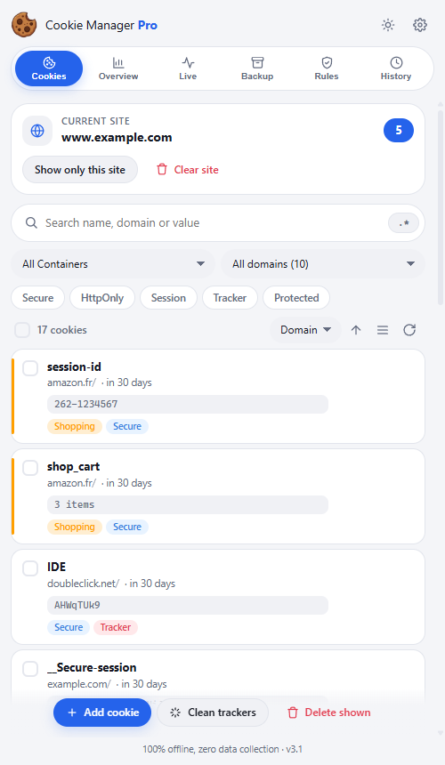
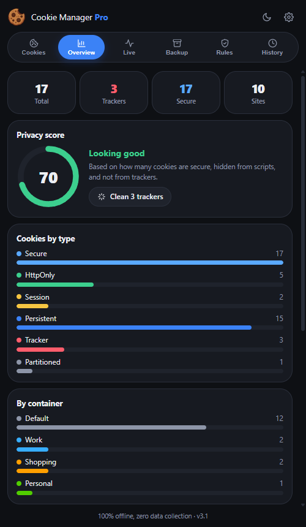
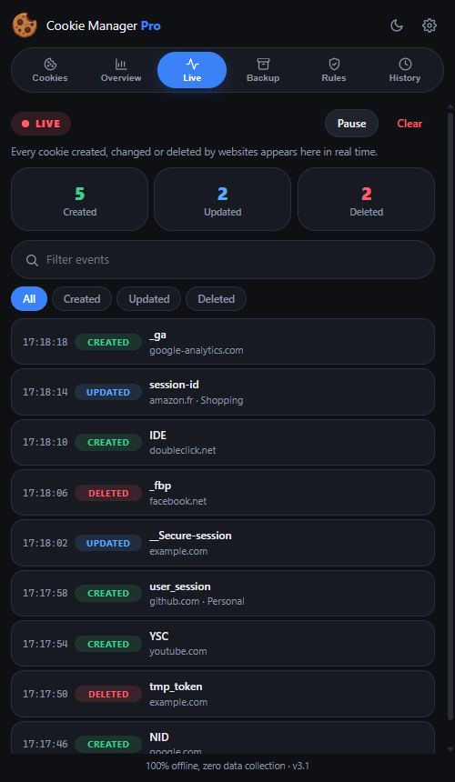
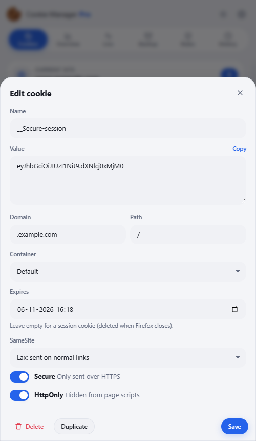
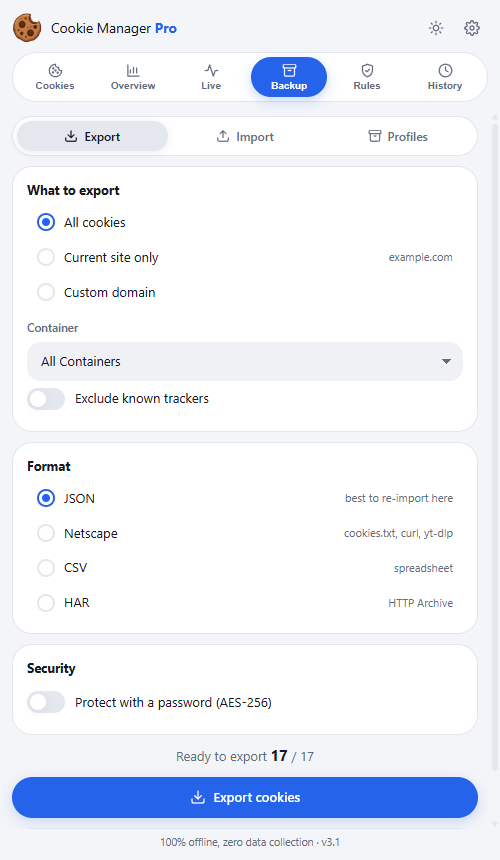

<h1 align="center">Cookie Manager Pro</h1>

  View, edit, protect, clean and back up your cookies in Firefox - with full container support. 
  <b>100% offline. Zero data collection. Zero dependencies.</b>

  
  
  

---

## Screenshots

  
  
  

  
  

## Features

| Tab | What you can do |
|-----|-----------------|
| **Cookies** | Search (text or regex), filter by container / site / type, sort, multi-select, edit, create, duplicate, protect, copy, delete with undo |
| **Overview** | Privacy score, cookies by type, by container, top sites (click to filter) |
| **Live** | Real-time feed of cookies created, updated and deleted by websites |
| **Backup** | Export (JSON, Netscape cookies.txt, CSV, HAR, optional AES-256 password), import with preview, profiles (snapshots), automatic backup |
| **Rules** | Automatic rules: delete or protect cookies by domain, name or regex, optional delay, per container |
| **History** | Log of every action, undo last deletion |

**Protected cookies** are restored automatically if a website or rule deletes them.

**Languages**: English, Francais, Espanol, Deutsch, Portugues, Italiano, Japanese, Chinese, Arabic (RTL).

## Keyboard shortcuts

| Keys | Action |
|------|--------|
| `Alt+Shift+C` | Open / close the sidebar |
| `/` | Search |
| `Del` | Delete selected cookies |
| `Ctrl+A` | Select all shown cookies |
| `Ctrl+Z` | Undo |
| `Ctrl+Shift+E` | Quick export |
| `Esc` | Close dialog |

## Install

**From Firefox Add-ons** (recommended): [**Get Cookie Manager Pro**](https://addons.mozilla.org/firefox/addon/cookie_manager/)

**Manual install** (temporary, until Firefox restarts):
1. Download this repository (green **Code** button > **Download ZIP**) and unzip it.
2. Open `about:debugging#/runtime/this-firefox`.
3. Click **Load Temporary Add-on** and pick the `manifest.json` file from the unzipped folder.

## Permissions

| Permission | Why |
|------------|-----|
| `cookies` | Read and write cookies |
| `<all_urls>` | Access cookies of every website |
| `contextualIdentities` | List Firefox containers |
| `tabs` | Know the current site |
| `storage` | Save rules, profiles and protected cookies |
| `clipboardWrite` | Copy cookie values |

## Privacy

Everything stays on your device. The extension makes **no network request**, has **no analytics** and uses **no third-party code**. Password-protected exports are encrypted with AES-256.

## License

[MIT](LICENSE) - made by [0XLUC4](https://github.com/0XLUC4)
